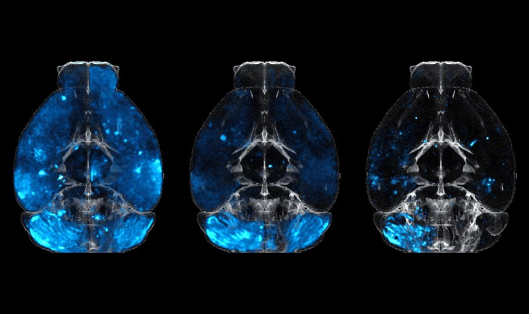

# Hi, I'm Athena!
**Postdoc**  •  **Computational Engineer**

## Education

* Ph.D., Computational Science and Engineering, D-MAVT, ETH Zürich, 2020
* M.Sc., Mechanical Engineering, University of Cyprus, 2015
* B.Sc., Mechanical Engineering, University of Cyprus, 2013

## Research Interests

My research interests lie at the interface of Computational Science and Bio-Engineering.
I enjoy developing computational tools and algorithms to solve problems in Computational Biology.
Current and past applications include: Image Processing for 3D biological datasets, Modeling and Simulation of biological flows, and Uncertainty Quantification for the inference and calibration of model parameters.

## Selected Projects

### Segmentation of neuronal cells in whole mouse brains

An international collaboration aiming to develop a new protein-based delivery system to the central nervous system of the brain. 3D images of whole mouse-brain scans were used to detect the bio-distribution of the delivery system, using light-sheet microscopy.
Image processing was performed using a custom, in-house developed pipeline, employing shared-memory parallelism, targeted for fast processing of large 3D image datasets.
*Publication under review in Cell.*
 

### Segmentation of microglia cells in drug efficacy studies

A study for the efficacy of different drugs in neurodegenerative diseases.
A novel image processing pipeline was developed to quantify drug efficacy on the sub-cellular level, through object segmentation of stained neural cells in 3D whole mouse-brain scans.
*Publication under preparation.*
 

### Quantification of the stress-free state and viscoelastic properties of human red blood cells

Human erythrocytes are the dominant constituents of blood comprising around 50% of blood volume.
It is well known that their dynamics are governed by the visco-elastic properties of their membrane.
Despite its importance, today’s RBC membrane models are not able to predict blood flows without case specific adjustment of their parameters.
Additionally, RBC models rely on the assumption of a stress-free state (SFS) of the cytoskeleton, which is currently arbitrarily selected, and current experimental methods cannot measure it directly.
We introduced a transferable RBC model (t-RBC), and calibrated its viscoelastic properties as well as the SFS for the first time, using Bayesian inference.
The t-RBC model is tested on several flow configurations, and is shown to reproduce a wide range of experimental data without further calibration of its parameters.
We believe that the model introduced in this study opens new frontiers for high fidelity predictions of blood flows.  
 

[Publication (2023):](https://www.sciencedirect.com/science/article/pii/S0006349523001728)  *Amoudruz, L., Economides, A., Arampatzis, G. and Koumoutsakos, P., 2023. The stress-free state of human erythrocytes: Data-driven inference of a transferable RBC model. Biophysical Journal.* 

[Publication (2021):](https://journals.aps.org/prapplied/abstract/10.1103/PhysRevApplied.15.034062)  *Economides, A., Arampatzis, G., Alexeev, D., Litvinov, S., Amoudruz, L., Kulakova, L., Papadimitriou, C. and Koumoutsakos, P., 2021. Hierarchical Bayesian uncertainty quantification for a model of the red blood cell. Physical Review Applied, 15(3), p.034062.*

### Uncertainty quantification in realistic, computationally expensive engineering models

Korali is an open-source framework for large-scale Bayesian uncertainty quantification and stochastic optimization.
The framework relies on non-intrusive sampling of complex multiphysics models and enables their exploitation for optimization and decision-making.
Its distributed sampling engine makes efficient use of massively-parallel architectures, while introducing novel fault tolerance and load balancing mechanisms.
The capabilities of the framework were demonstrated in a set of study cases, with applications on molecular dynamics, blood microfluidics, and pipe flow optimization.
 

[Publication (2022):](https://www.sciencedirect.com/science/article/pii/S0045782521005752)  *Martin, S.M., Wälchli, D., Arampatzis, G., Economides, A.E., Karnakov, P. and Koumoutsakos, P., 2022. Korali: Efficient and scalable software framework for Bayesian uncertainty quantification and stochastic optimization. Computer Methods in Applied Mechanics and Engineering, 389, p.114264.*

[Publication (2020):](https://dl.acm.org/doi/abs/10.1145/3394277.3401849)  *Wälchli, D., Martin, S.M., Economides, A., Amoudruz, L., Arampatzis, G., Bian, X. and Koumoutsakos, P., 2020, June. Load balancing in large scale bayesian inference. In Proceedings of the Platform for Advanced Scientific Computing Conference (pp. 1-12).*

## Experience

* **Postdoctoral Researcher, University of Zurich** 
*03/2023 - present* 
Institute of Neuropathology | Prof. Adriano Aguzzi 
Department of Quantitative Biomedicine | Prof. Magdalini Polymenidou

* **External Lecturer, ETH Zurich** 
*01/2023 - present* 
Course: High Performance Computing for Science and Engineering II 
Department of Mechanical and Process Engineering (D-MAVT)

* **Teaching Fellow & Postdoctoral Associate, Harvard University** 
*01/2021-12/2022* 
Course: Introduction to Fluid Mechanics and Transport Processes 
John A. Paulson School of Engineering and Applied Sciences

* **Postdoctoral Researcher, ETH Zurich & University Hospital of Zurich** 
*11/2020-12/2022* 
Computational Science and Engineering lab | Prof. Petros Koumoutsakos 
Institute of Neuropathology | Prof. Adriano Aguzzi

* **Visiting PhD student, Massachusetts General Hospital** 
*03/2017-06/2017* 
Center for Engineering in Medicine | Prof. Mehmet Toner

* **Research Assistant (PhD student), ETH Zurich** 
*10/2014-10/2020* 
Computational Science and Engineering lab | Prof. Petros Koumoutsakos

## Teaching

* External Lecturer, HPCSE II, ETH Zurich (Spring 2023)
* Head TA: High Performance Computing for Science and Engineering I (Fall 2022)
* Teaching Fellow, ES123, Harvard University (Spring 2022)
* Head TA: High Performance Computing for Science and Engineering II (Spring 2021)
* TA: High Performance Computing for Science and Engineering I (2017-2019)
* TA: Computational Methods for Engineering Applications (2015-2016)
* TA: Engineering Tool III: Object oriented programming with C++ (Spring 2015)

## Links

<i class="fa-solid fa-graduation-cap"></i> [Google Scholar](https://scholar.google.com/citations?user=EICX1aMAAAAJ) • <i class="fa-brands fa-linkedin"></i> [Linkedin](https://ch.linkedin.com/in/athena-economides) • <i class="fa-solid fa-laptop"></i> [Workpage UZH](https://www.polymenidoulab.com/people.html) • <i class="fa-solid fa-laptop"></i> [Workpage ETHZ](https://www.cse-lab.ethz.ch/member/athena-economides/)

## Contact

<i class="fa-solid fa-envelope"></i> athena[dot]economides[at]uzh[dot]ch

ETH Zurich & University of Zurich 
CH-8006, Zurich 
Switzerland 

